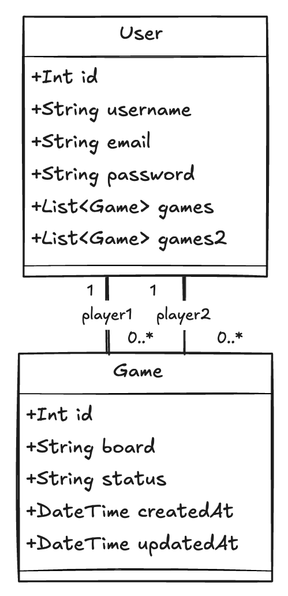

# WSF-Morpion

Ce projet est un jeu de morpion simple réalisé en utilisant **Node.js**, **Express**, et **Prisma** pour la gestion des utilisateurs, l'authentification et la création de parties.

## Prérequis

    - Nodejs
    - npm / npx
    - BBD Postgresql (https://www.postgresql.org/download/)

## Installation

cloner le repository Github

Lancement du serveur :

```bash
git clone https://github.com/Hugo-brch/WSF-Morpion.git
cd WSF-MORPION/server
npm install
npx prisma migrate dev --name init
node server.js
```

Lancement du client :

```bash
git clone https://github.com/Hugo-brch/WSF-Morpion.git
cd WSF-MORPION/client
npm install
node client.js
```

Vous aurez ensuite 3 dossiers :

- **server** : Contient l'API et toute la logique du jeu.

- **api-testing-bruno** : Contient les tests API et les requêtes pour 2 joueurs. Fonctionne avec l'application Bruno.

- **client** : L'interface en Node.js pour jouer plus simplement au morpion. Le client peut gérer deux joueurs en même temps.

# Architecture de chaque répertoire

## Server

Le fichier `server.js` est le point de lancement de l'API. Lors du lancement, on teste la connexion à la base de données. Ensuite, on importe les différentes routes.

On lance le serveur sur le port 3000

### Register

Le lien de l'API est `/api/v1/users/register`.  
Les éléments suivants sont requis dans le body :

```json
{
  "username": "user1",
  "password": "user1",
  "email": "user1@gmail.com"
}
```

- Les entrées vont être vérifiés. Si un élément est manquant dans la requête, l'API renverra un message d'erreur indiquant ce qui manque.
- Le mot de passe sera hashé avec la librairie bcrypt.

- Ensuite, une requête Prisma stocke toutes les informations dans la base de données.

- Un token JWT sera généré et envoyé en réponse si tout se passe bien. Sinon, un message d'erreur sera renvoyé à l'utilisateur.

### Login

Le lien de l'API est `/api/v1/users/login`.  
Les éléments suivants sont requis dans le body :

```json
{
  "username": "user1",
  "password": "user1"
}
```

- L'API va ensuite chercher le nom d'utilisateur dans la base de données.
- Si elle trouve un utilisateur, elle vérifie le mot de passe en le comparant avec la méthode `compare` de bcrypt. Si aucun utilisateur n'est trouvé, un message d'erreur indiquant que l'utilisateur n'existe pas ou n'est pas valide sera renvoyé.

- Ensuite, un token JWT sera généré et envoyé en réponse à l'API si tout se passe bien.

### Création d'une partie

Le lien de l'API est `/api/v1/games`.  
Les champs suivants sont requis :

```json
{
  "player1Id": 13,
  "player2Id": 14
}
```

- Récupère l'ID des joueurs de la partie.

- Crée un nouvel élément dans la table `Game` en fournissant l'ID des deux joueurs, un plateau vide (pour s'assurer que le plateau est vide) et le statut de la partie `en cours`.

- Si la requête est réussie et qu'il ne manque rien, l'API renvoie les informations de la partie avec l'ID de la partie.

- Si la requête échoue, un statut 500 est envoyé, indiquant à l'utilisateur que la création de la partie a échoué.

### Information de la partie

Le lien de l'API est `/api/v1/games/$id`.  
Les champs suivants sont requis :

```json
{
  "id": 12
}
```

- On récupère l'ID envoyé par l'utilisateur.

- On fait une requête à la base de données pour trouver la partie en fonction de cet ID et on retourne les informations de la partie (joueurs, statut, plateau, ID).

- On ajoute une condition qui, dans le cas où aucune partie n'est trouvé avec cet ID, retourne un message "not found".

- Si la requête échoue, on retourne une erreur 500.

### Jouer un coup

Le lien de l'API est `/api/v1/games/$gameid/move`.  
Les champs suivants sont requis :

```json
{
  "playerId": 13,
  "position": 5
}
```

- On récupère l'ID de la partie, l'ID du joueur et la position (comprise entre 0 et 8).

- Ensuite, on récupère la partie avec cet ID en effectuant une requête Prisma à la base de données.

- On ajoute une condition pour vérifier que l'ID de la partie existe. Si ce n'est pas le cas, on envoie une erreur au client.

- On vérifie si le statut de la partie est différent de `en cours`.

- On vérifie si l'ID du joueur qui joue correspond bien au joueur associé à la partie. Si ce n'est pas le cas, on envoie un message d'erreur avec un code 403.

- On vérifie si la position choisi par le joueur est valide (c'est-à-dire qu'elle n'est pas déjà prise). Si c'est le cas, on continue, sinon, on envoie un message d'erreur.

- On ajoute une condition pour déterminer quel joueur joue et son symbole.

- On vérifie s'il y a un gagnant en utilisant les combinaisons gagnantes. Sinon, on regarde s'il reste des cases vides sur le plateau. S'il n'y en a plus, la partie est déclarée nulle. Sinon, la partie continue.

- Si un gagnant est déterminé ou si le plateau est plein, on effectue une requête Prisma pour mettre à jour la base de données et on retourne le gagnant aux utilisateurs.

### Midleware authentification

Pour chaque requête différente de login et register, on vérifie que le token JWT est bien présent dans la requête API. S'il est présent, alors on utilise la méthode `verify` de la librairie `jwt` pour essayer de le décoder avec le token secret récupéré depuis le fichier `.env`.

Dans le cas où nous n'arrivons pas à le décoder, nous renvoyons un message d'erreur `invalid token`. Si le token est valide, nous stockons le token décodé dans `req.user`. Ensuite, nous appelons la fonction `next` pour passer à l'étape suivante.

### Schéma de base de données

Prisma est un ORM, ce qui permet de faire du SQL sans écrire du SQL. Toutes les informations et modifications sont dans un répertoire nommé `prisma`. Ce répertoire contient le schéma et les migrations.

#### Diagramme d'interconnexion de la base de données :



## Client

Le client vous permet de profiter au maximum du jeu, en effectuant automatiquement les requêtes API.  
Il offre différentes fonctionnalités : vous pouvez vous enregistrer, vous connecter avec deux compte simultanément, créer une partie et y jouer.

### Librairies utilisées

Pour effectuer les requêtes API, nous utilisons `axios`.  
Pour simplifier l'utilisation, nous utilisons `readline`, qui permet d'avoir une interface en ligne de commande interactive.

### Fonctionnement de base

Lors du lancement, la première fonction qui se lance est `mainMenu`, qui est le menu principal. Vous pourrez ainsi :

- **S’enregistrer** :

  - Enregistré un nouvel utilisateur en demandant un nom d’utilisateur et un mot de passe, puis en envoyant ces informations au serveur.

- **Se connecter en tant que Joueur 1** :

  - Permet au premier joueur de se connecter en fournissant son nom d’utilisateur et son mot de passe. Les informations de connexion sont ensuite envoyées au serveur pour authentification.

- **Se connecter en tant que Joueur 2** :

  - Permet au second joueur de se connecter de la même manière que le Joueur 1.

- **Créer un jeu** :

  - Crée un nouveau jeu en utilisant les informations des deux joueurs connectés. Le plateau de jeu initial est affiché et le jeu commence.

- **Quitter** :
  - Permet de quitter l’application.

#### Déroulement du jeu

- **Affichage du plateau** :

  - Le plateau de jeu est affiché dans la console pour que les joueurs puissent voir l’état actuel du jeu.

- **Jouer un coup** :

  - Les joueurs jouent à tour de rôle en entrant la position où ils souhaitent jouer. Le coup est envoyé au serveur, qui met à jour le plateau de jeu et vérifie l’état du jeu.

- **Boucle de jeu** :
  - Le jeu continue jusqu’à ce qu’il y ait un gagnant ou que le jeu soit terminé. La boucle de jeu gère les tours des joueurs et vérifie la validité des coups.
